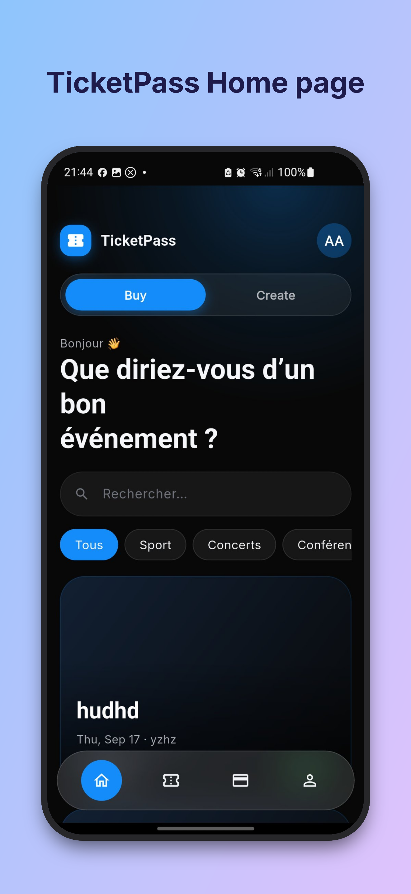
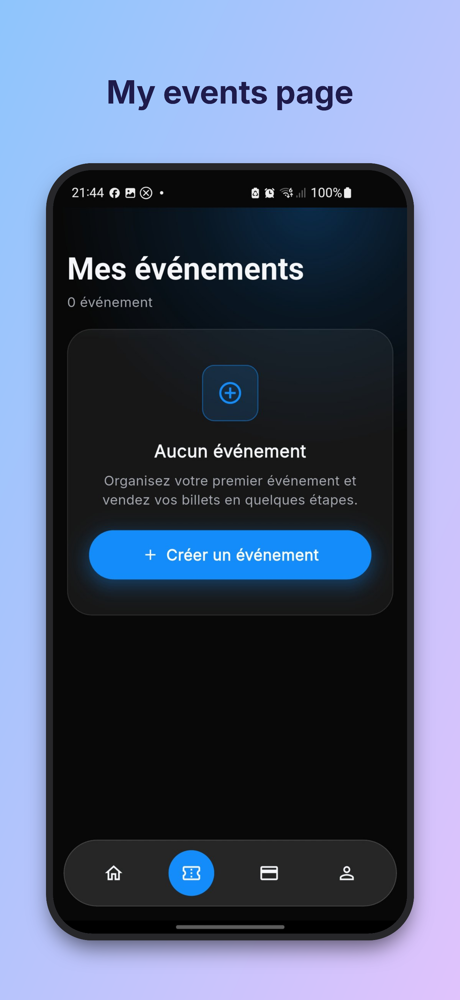
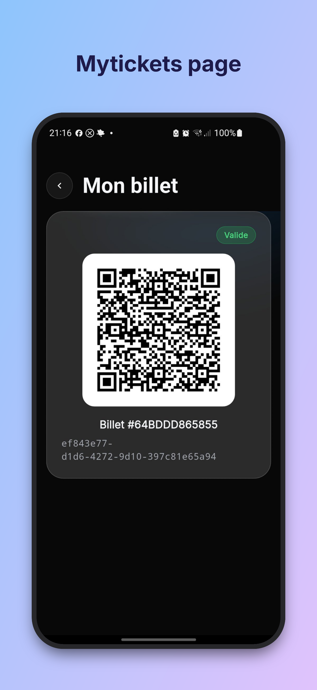
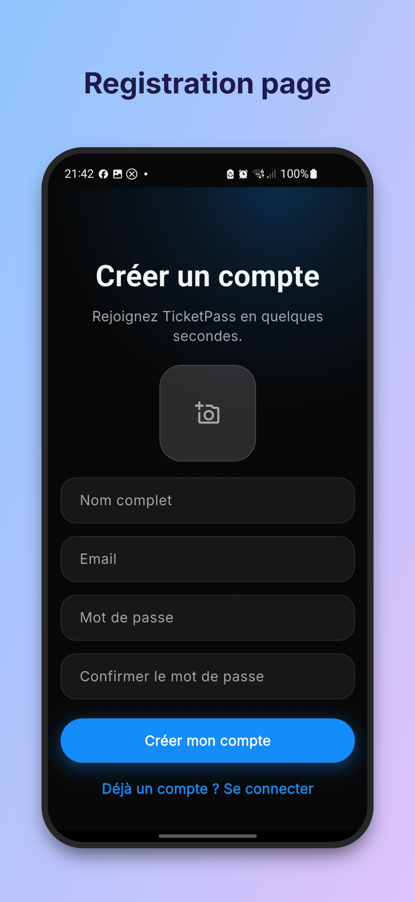
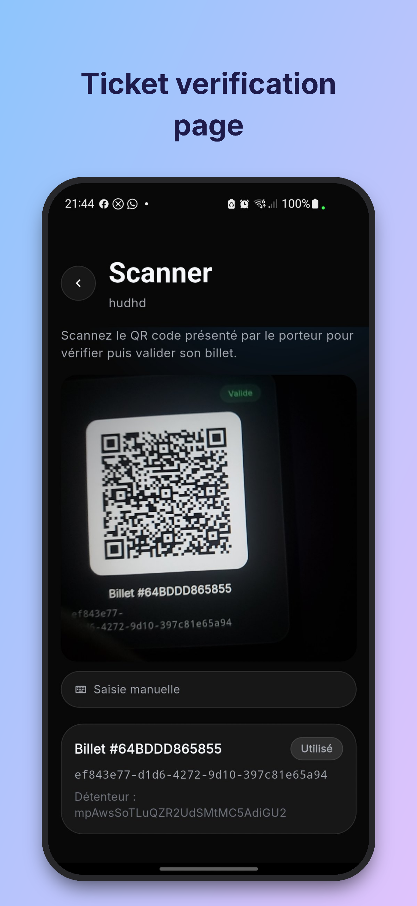
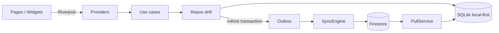
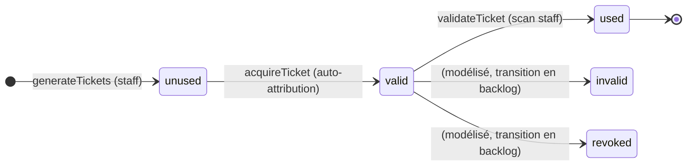
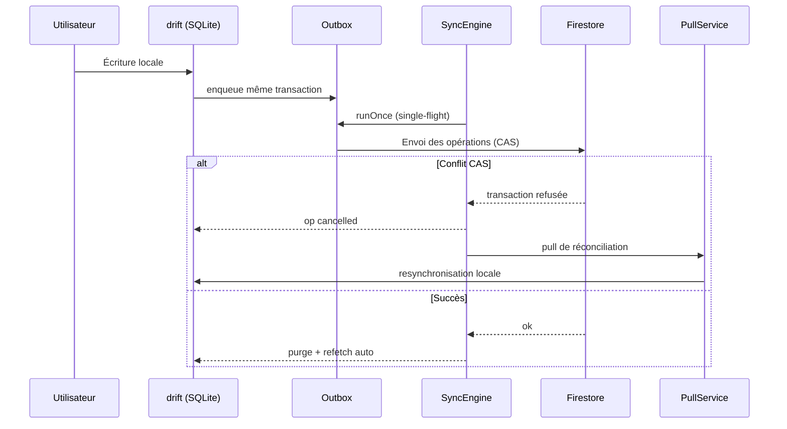

# TicketPass

Billetterie mobile : découvrez des événements, obtenez des billets au code QR **signé cryptographiquement**, et scannez-les à l'entrée - **même sans réseau**.

Version 1 complète : Clean Architecture, cache **SQLite (drift)** local-first, **Firebase** comme source de vérité, et un moteur de synchronisation avec **transactions CAS** et reprise automatique.

| | |
|---|---|
| **Plateformes** | Flutter - Android / iOS |
| **Stack** | Riverpod 3, GoRouter 18, drift (SQLite), Firestore, Firebase Auth + Storage |
---

## Présentation

Trois rôles dans l'application :

- **Organisateur** : crée un événement, génère les billets (QR signés), consulte les participants, nomme des contrôleurs, supprime l'événement.
- **Participant** : découvre le catalogue, obtient un billet unique (double achat refusé), l'affiche en QR dans son wallet.
- **Contrôleur** : scanne le QR à l'entrée : vérification **hors-ligne** de la signature, puis transition d'état atomique `VALIDE → UTILISÉ`.

Le projet se distingue sur deux points : **la sécurité de la billetterie** (QR signé + règles Firestore avec transitions conditionnelles) et **le mode hors-ligne** (tout fonctionne sans réseau, tout converge ensuite).

--- 

## Captures d'écran

| | |
|---|---|
|  |  |
|  |  |
|  | |

---

## Fonctionnalités

| Rôle | Fonctionnalités |
|---|---|
| Tous | Authentification email/mot de passe (Firebase Auth), profil + avatar (Storage), catalogue + recherche + filtres |
| Organisateur | Créer / éditer / supprimer un événement, générer N billets, consulter les billets, participants, désigner des contrôleurs |
| Participant | Obtenir un billet (double achat refusé), wallet « Mes billets », détail billet + QR |
| Contrôleur | Scan caméra + saisie manuelle, vérification de signature hors-ligne, validation d'entrée |

Parcours clé : découverte → détail → achat → QR → scan / validation, avec gestion des rôles pour le staff.

---

## Architecture

**Clean Architecture** :

- **Domain** : entités, use cases, contrats (`EventRepository`, `TicketRepository`, `AuthUserRepository`) ;
- **Data** : repositories **drift** (SQLite local) + datasources **Firestore** ;
- **Sync** : outbox, moteur de convergence, pull, cycle de vie (segment « local-first » ci-dessous) ;
- **Presentation** : Riverpod (providers) + design system maison (`lib/core/theme`, `lib/core/widgets`).



**Stack** : `flutter_riverpod` · `go_router` · `drift` · `firebase_core/auth/firestore/storage` · `connectivity_plus` · `crypto` (HMAC) · `qr_flutter` · `mobile_scanner` · `google_fonts` — développement : `mocktail`, `fake_cloud_firestore`.

---

## Sécurité de la billetterie

### 1. Rôles et permissions

Chaque événement porte sa collection de rôles (`events/{id}/roles/{uid}`). Le créateur devient **organiser** à la création ; seul l'organisateur nomme des **controller**. Aucune action staff sans rôle vérifié — côté client **et** Firestore Rules.

### 2. QR signé, vérification 100 % hors-ligne

Chaque billet embarque une **signature HMAC-SHA256** : `HMAC_sha256(secret, "ticketId:eventId")`.

```text
payload QR = <ticketId> | <eventId> | <signature>
```

La vérification s'effectue **à la lecture du QR, sans aucun appel réseau** : la signature est recalculée puis comparée. C'est ce contrôle d'authenticité qui protège la billetterie contre les billets forgés, y compris dans une salle sans couverture.

### 3. Transitions d'état et règles Firestore (CAS)

Le cycle de vie du billet est garanti en deux couches — cache drift local et Firestore distant :



Chaque écriture est **conditionnelle sur l'état avant écriture** (compare-and-swap) :

| Transition | Condition (Firestore Rules) | Acteur |
|---|---|---|
| `unused → valid` (acquisition) | `status == 'unused'` et `user_id == ''` et `user_id futur == request.auth.uid` | le demandeur lui-même |
| `valid → used` (validation) | `status == 'valid'` et `isStaff(eventId)` | organiser / controller |

Autres règles : **lecture** des billets réservée au détenteur, aux billets encore libres (nécessaire au scan/achat) ou au staff ; **création** des billets réservée au staff ; suppression chez le staff ; modification/suppression d'événement chez l'organiser ; profil modifiable par le seul utilisateur concerné.

Toute transgression est bloquée deux fois : par les règles (autorité) et par le repository local (UX). En cas de conflit sur Firestore, l'opération est marquée `cancelled` et un **pull de réconciliation** remet l'état local en phase (voir section suivante).

## Mode hors-ligne et synchronisation

Le téléphone est le premier dépôt ; Firestore est la **source de vérité**. Toutes les écritures passent par une file d'**outbox** transactionnelle.

### Écriture = mutation drift + enqueue outbox (même transaction)

Création d'événement, génération de billets, acquisition, validation, suppression : chaque écriture locale enqueue sa contrepartie (`event/create`, `ticket/acquire`, …) **dans la même transaction SQLite**. Impossible d'écrire localement sans prévoir la synchronisation.

### Envoi (SyncEngine)

- `runOnce()` en **single-flight** (jamais deux envois concurrents) ;
- transitions **CAS** sur Firestore (état attendu exigé) ;
- échec réseau → **backoff exponentiel 2 s → 5 min, 8 tentatives max** ;
- conflit CAS → opération `cancelled` + pull de réconciliation immédiat ;
- purge des opérations terminées.

### Réconciliation descendante (PullService)

Au boot / à la reconnexion / après conflit :

- **événements** : upsert avec `ticketsNumber = max(local, count)` — le compteur local n'est **jamais écrasé à la baisse** par le distant ;
- **rôles** : union du distant avec les assignations encore pendantes (aucune perte pendant un envoi) ;
- **suppressions** : les éléments absents sont retirés **sauf si une opération pendante existe** ; un **tombstone** empêche le pull de recréer un événement supprimé ;
- **billets** : les miens + ceux des événements dont je suis staff.

### Déclenchement automatique

Le cycle de vie de la sync (lancé uniquement dans `main()`, jamais en test) s'abonne à l'authentification et à `connectivity_plus` :

- **boot hors-ligne** : pas de pull ni d'envoi — l'application sert le cache local ; la reprise est automatique au retour du réseau ;
- chaque cycle terminé déclenche **un refetch automatique** des providers (catalogue, événements, wallet), sans aucune action manuelle.



---

## Qualité

Stratégie de test, sans aucune dépendance réseau :

- **drift en mémoire** (`NativeDatabase.memory()`) pour les repositories et le moteur de sync ;
- **`fake_cloud_firestore`** pour les datasources et la sync (jamais de règles ni de timer en arrière-plan en test) ;
- **mocktail** pour les contrats d'authentification (widget tests) ;
- fakes de widget isolés dans `test/helpers/` — aucun faux dans `lib/`, la production est 100 % réelle.

---

## Premiers pas

```bash
# 1. Cloner et restaurer
git clone <url-du-depot>
cd ticketpass
flutter pub get

# 2. Configurer Firebase (Firestore + Auth + Storage + Rules)
flutterfire configure                  # génère lib/firebase_options.dart
firebase deploy --only firestore:rules # applique deploy/firestore.rules

# 3. Vérifier la santé du projet
flutter analyze
flutter test

# 4. Lancer
flutter run
```

---

## Structure du projet

```
lib/
├── main.dart                  # wiring : Firebase, SyncEngine, cycle de vie de la sync
├── core/
│   ├── database/              # schéma drift (events, tickets, roles, sync_outbox)
│   ├── sync/                  # outbox, handlers, engine, pull, cycle de vie
│   ├── routing/               # GoRouter : 13 routes (4 onglets + pages plein-écran)
│   ├── security/              # signature HMAC-SHA256 des billets
│   ├── theme/  widgets/       # design system maison
├── features/
│   ├── auth/                  # Firebase Auth + profil + avatar
│   ├── event/                 # événements, rôles, participants, création/édition
│   ├── ticket/                # génération, achat, wallet, validation, QR
│   ├── scan/                  # scan caméra / saisie manuelle, vérification hors-ligne
│   ├── home/  profile/
test/                          # 140 tests — helpers + domain/data/presentation
deploy/firestore.rules         # règles d'accès de référence
docs/classe.md                 # modèle de données, règles métier, use cases
docs/ONBOARDING_DOMAIN_DATA.md # domaine, data, sync — points de vigilance
```

---

## Documentation

- **`docs/classe.md`** — diagramme de classes, règles métier, use cases
- **`docs/ONBOARDING_DOMAIN_DATA.md`** — domaine/data/sync, pièges connus