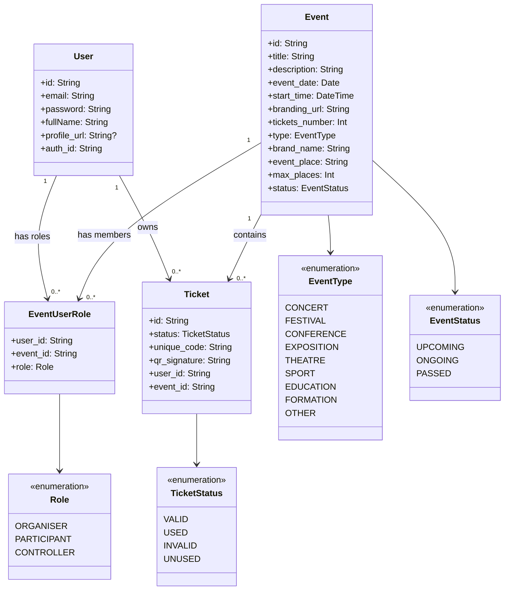

# Diagramme de classes — TicketPass



## Clés et contraintes

### User

```text
User
-----
id          PK
email       UNIQUE
auth_id     UNIQUE
```

`id` est la clé primaire de l'utilisateur.

`email` et `auth_id` doivent normalement être uniques si un compte ne peut être associé qu'à une seule identité.

---

### Event

```text
Event
-----
id          PK
```

`id` est la clé primaire de l'événement.

---

### EventUserRole

Cette table est la table d'association entre `User` et `Event`.

```text
EventUserRole
-------------
user_id     FK → User.id
event_id    FK → Event.id
role        Role
```

La contrainte recommandée est :

```text
PRIMARY KEY (user_id, event_id, role)
```

Cela permet notamment d'avoir plusieurs rôles pour un même utilisateur sur un même événement.

Exemple :

```text
user_id   event_id   role
--------  ---------  ----------
U001      E001       ORGANISER
U001      E001       CONTROLLER
```

Cela permet de représenter directement la règle métier :

> The organizer can be the controller.

Si, au contraire, un utilisateur ne peut avoir **qu'un seul rôle par événement**, utiliser :

```text
PRIMARY KEY (user_id, event_id)
```

et conserver `role` comme simple attribut.

---

### Ticket

```text
Ticket
------
id              PK
user_id         FK → User.id
event_id        FK → Event.id
status          TicketStatus
unique_code     UNIQUE
qr_signature
```

Les deux clés étrangères sont nécessaires :

```text
Ticket.user_id  → User.id
Ticket.event_id → Event.id
```

Elles permettent de répondre à :

* À quel participant appartient ce ticket ?
* Pour quel événement ce ticket a-t-il été généré ?

`unique_code` doit également être `UNIQUE`, puisqu'il sert à identifier le ticket.

---

## Règles métier des tickets

```text
UNUSED
→ Ticket généré mais pas encore attribué/acheté.

VALID
→ Ticket acheté par un participant et utilisable.

USED
→ Ticket scanné et utilisé le jour de l'événement.

INVALID
→ Ticket non utilisé alors que la date de l'événement est dépassée.

REVOKED
→ Ticket invalidé par l'organisateur (ex: remboursement, fraude, etc.).
```

## Règle métier des rôles

```text
ORGANISER
→ Utilisateur responsable de l'événement.

PARTICIPANT
→ Utilisateur participant à l'événement.

CONTROLLER
→ Utilisateur autorisé à contrôler/scanner les tickets.
```

Un même utilisateur peut cumuler plusieurs rôles sur un même événement.

Exemple :

```text
User
  │
  └── EventUserRole
        ├── event_id = E001
        └── role = ORGANISER

        +
        
        ├── event_id = E001
        └── role = CONTROLLER
```

## Structure relationnelle finale

```text
User
 │
 ├──────────────< Ticket >────────────── Event
 │                                      │
 │                                      │
 └──────< EventUserRole >───────────────┘
                │
                └── role: Role
```

### Résumé des clés

| Table           | Clé primaire                 | Clés étrangères                            |
| --------------- | ---------------------------- | ------------------------------------------ |
| `User`          | `id`                         | —                                          |
| `Event`         | `id`                         | —                                          |
| `Ticket`        | `id`                         | `user_id → User.id`, `event_id → Event.id` |
| `EventUserRole` | `(user_id, event_id, role)`* | `user_id → User.id`, `event_id → Event.id` |

* Si plusieurs rôles par événement sont autorisés.
